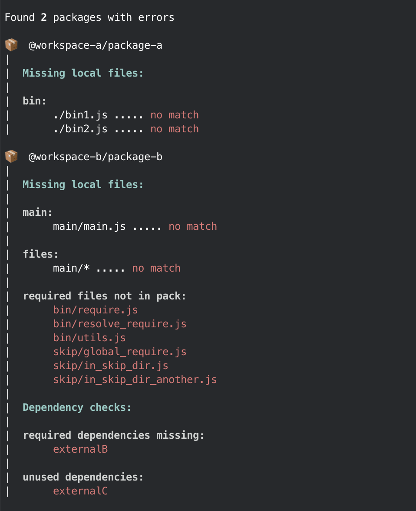

<h1 align="center" border="none">
  Repkgs
  <br/>
  <br/>
  📦
  <br/>
  <br/>
</h1>

<p align="center">
  verifying the correctness of your published npm packages
</p>

<p align="center">
  
</p>

- [What is Repkgs](#what-is-repkgs)
- [Commands](#commands)
  - [verify-files](#verify-files)

## What is Repkgs?

Repkgs focuses on verifying the correctness of your packages by checking for missing files and dependencies in packages.

Repkgs works for single and multi-repos and adds a common interface for running commands against projects using Yarn Workspaces, Yarn v2 Nested Workspaces, Lerna, Pnpm and Rush.

## Commands

### `verify-files`

```
❯ repkgs verify-files
```

`verify-files` uses the `package.json` to confirm that the published package will contain all required files.

#### Fields checked

```
{
  "bin": ...,
  "main": ...,
  "types": ...,
  "files": ...
}
```

#### Problem: missing `bin` file

A package can break if the `bin` or `main` field does not point to the right location. If your project has a build step it is very easy for the paths listed in your `package.json` to point to nothing.

_How Repkgs helps_

Repkgs will run checks against the file paths found in the `package.json` to make sure those files exists and protect you from publishing a broken package.

#### Problem: required files not in bundle

Following best practices and setting the `files` field to keep your package size down can easily cause required files to be left out of your published package.

_How Repkgs helps_

Repkgs will start with the patterns found in the `files` field of your `package.json` and recursively find all imported files. Any imported files not found in the bundle will be surfaced to protect you from publishing a broken package.

#### Example Output

